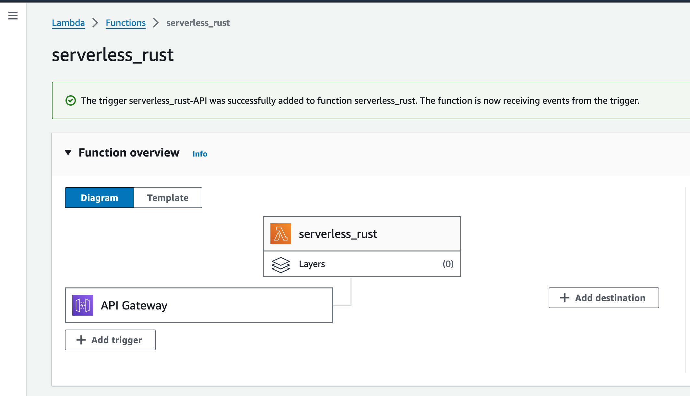
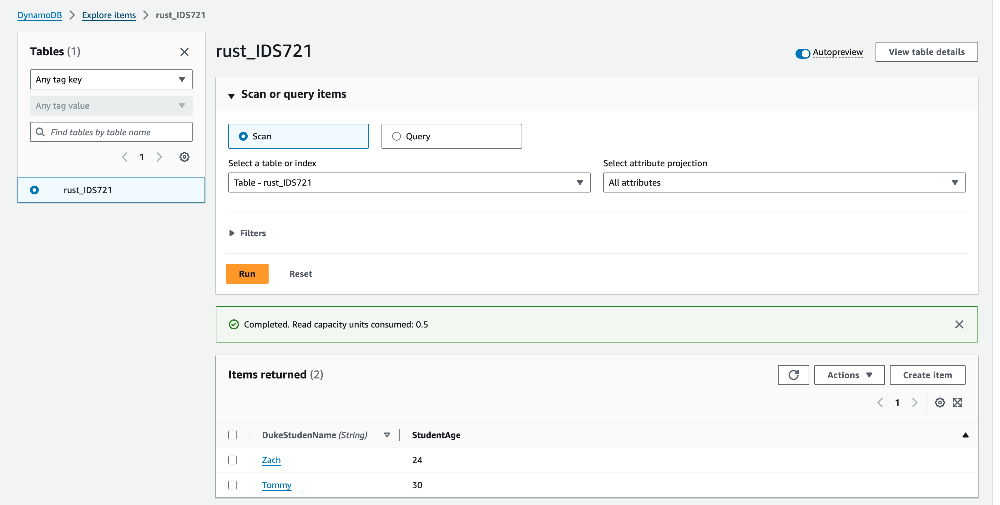
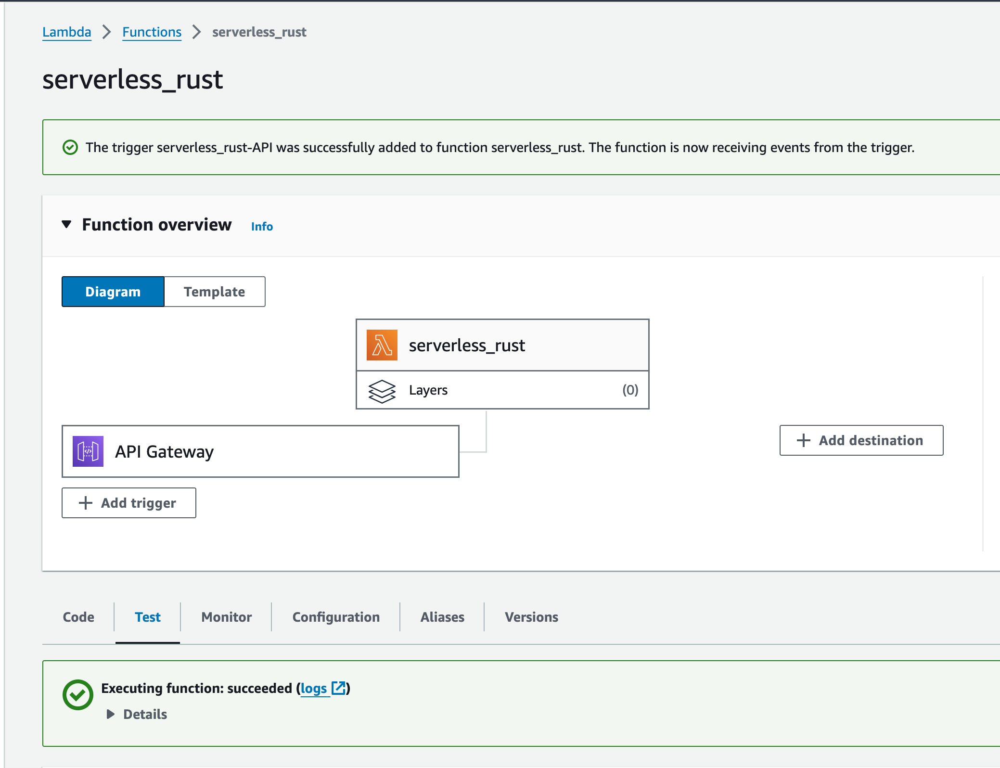

# Rust-Based Serverless Function for Returning Student's Age

This initiative focuses on constructing a serverless feature using AWS Lambda, crafted in Rust with Cargo Lambda, and connected to AWS DynamoDB. The essence of this project is to exploit AWS Lambda's potential, integrate with AWS API Gateway, and harness DynamoDB's power. The goal is to engineer a Lambda function that provides a student's age based on the student's name.

## Objectives

* Develop a serverless application or function in Rust for AWS Lambda
* Craft a straightforward service
* Establish a connection with a database

## Procedures

### Initialization of Rust Project

* Kickstart your project by generating a new Cargo Lambda project with `cargo lambda new <YOUR-PROJECT-NAME>`.
* Tailor the `Cargo.toml` and `src/main.rs` to fit your project's design and needs.
* In your project folder, locally test its functionality by executing `cargo lambda watch`.

### Setting up AWS

* Head to the AWS IAM Management Console to create a new IAM User for managing credentials.
* Assign the `LambdaFullAccess` and `IAMFullAccess` policies.
* In the `Security Credentials` tab, create an access key for API use. Ensure this key is securely stored.
* Configure your environment variables for Cargo Lambda to identify the AWS account and region for deployment.
  
  ```
  export AWS_ACCESS_KEY_ID="your_access_key_here"
  export AWS_SECRET_ACCESS_KEY="your_secret_key_here"
  export AWS_DEFAULT_REGION="your_preferred_region_here"
  ```
* Compile your project with `cargo lambda build --release`.
* Deploy your project using `cargo lambda deploy`.
* In the AWS console, under AWS Lambda, locate your function, click on `Configuration`, then `Permission`, and follow the link under `Role name`.
* In the opened tab, add the `AWSDynamoDBFullAccess` and `AWSLambdaBasicExecutionRole` policies to your role.

### DynamoDB Connection and API Setup

* Go to the AWS console to set up a DynamoDB table. In the `Items` tab, select `Create item`.
* Pick a name for your table that matches the one in your `main.rs`.
* Define the partition key, the primary key for your table.
* Fill in your item's details, i.e. name & age
* After setting up the table, connect your Lambda function to the AWS API Gateway.
* Start a new API with the default REST API option and create a new resource for your endpoint.
* For the new resource, set up an `ANY` method linked to your Lambda function.
* Deploy your API by setting up a new deployment stage.
* After deployment, locate your invoke URL under `stages`.

### Screenshots
* Deployed Lambda Function


* DynamoDB Table


* API test
